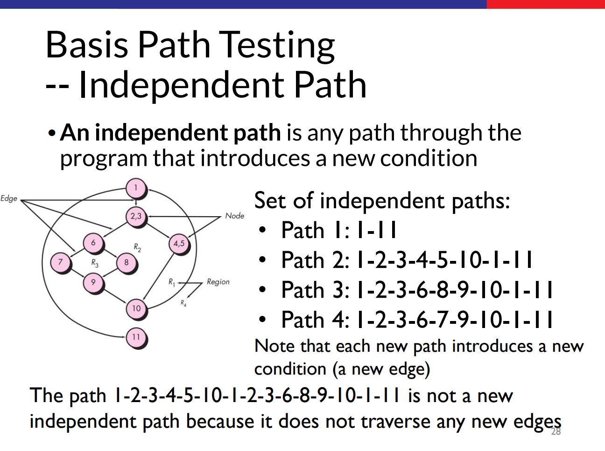
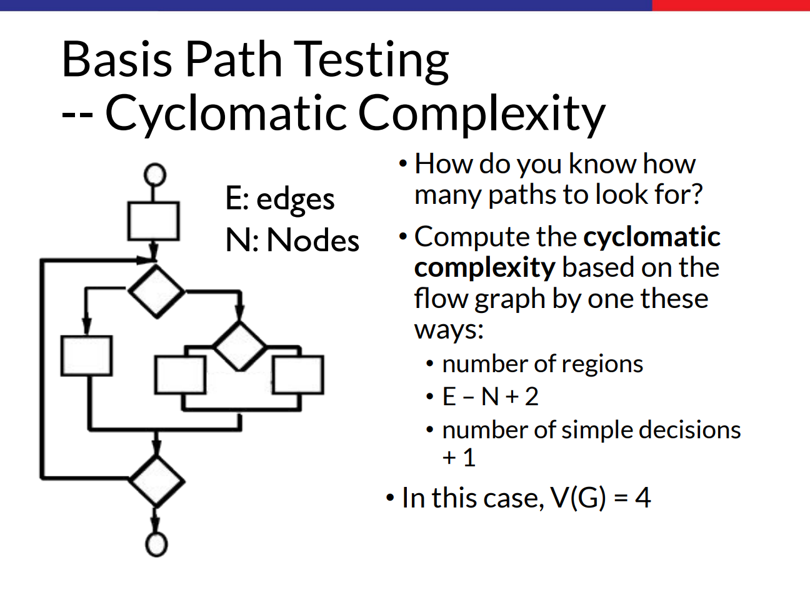

# Reflection 1

## Clean Code Principles & Secure Coding Practices

Selama pengerjaan fitur Edit dan Delete pada tutorial ini, saya telah menerapkan beberapa prinsip Clean Code dan Secure Coding sebagai berikut:

### 1. Meaningful Names (Penamaan yang Jelas)

Saya berusaha menggunakan nama variabel, method, dan class yang deskriptif dan mencerminkan tujuannya.

- **Contoh:** Penggunaan nama `ProductService`, `ProductRepository`, `create`, `edit`, dan `delete` yang secara eksplisit menjelaskan apa yang dilakukan oleh komponen tersebut. Variabel seperti `productId` dan `productName` juga jelas maknanya dibandingkan hanya menggunakan `id` atau `name` yang bisa ambigu.

### 2. Single Responsibility Principle (SRP)

Saya telah memisahkan tanggung jawab antar komponen sesuai arsitektur Spring Boot (MVC):

- **Controller (`ProductController`):** Hanya bertugas mengatur alur request (menerima input) dan menentukan view mana yang akan ditampilkan. Tidak ada logika bisnis yang berat di sini.
- **Service (`ProductServiceImpl`):** Bertugas menangani logika bisnis. Controller tidak mengakses Repository secara langsung, melainkan melalui Service ini.
- **Repository (`ProductRepository`):** Fokus hanya pada pengelolaan data (menyimpan, mencari, mengupdate, dan menghapus data dari List).

### 3. Penerapan UUID untuk ID Produk (Secure Coding)

Alih-alih menggunakan integer sekuensial (1, 2, 3...) untuk ID produk, saya menggunakan UUID (Universally Unique Identifier). Identifier digunakan untuk mendapatkan produk saat ingin melakukan edit di product tertentu

- **Alasan Keamanan:** Menggunakan ID sekuensial membuat data mudah ditebak (ID Enumeration Attack). Dengan UUID, penyerang akan sulit menebak ID produk lain hanya dengan melihat pola URL.

### 4. Penggunaan Lombok

Saya menggunakan anotasi `@Getter`, `@Setter` dari library Lombok pada model `Product`. Ini mengurangi boilerplate code yang tidak perlu, sehingga kode menjadi lebih ringkas dan fokus pada atribut data.

## Mistakes & Areas for Improvement

Meskipun fitur sudah berjalan, saya menyadari ada beberapa kekurangan dan pelanggaran best practice yang perlu diperbaiki:

### Kurangnya Validasi Input

**Kesalahan:**
Saya belum menambahkan validasi pada input form. Pengguna bisa saja menginput nama produk kosong atau jumlah kuantitas negatif.

**Perbaikan:**
Menambahkan anotasi validasi dari `jakarta.validation` (seperti `@NotBlank`, `@Min(0)`) pada model `Product`, dan menambahkan `@Valid` serta `BindingResult` pada Controller untuk menangani error input dengan lebih elegan.

# Reflection 2

### 1. Unit Testing & Code Coverage

**Perasaan setelah menulis Unit Test:**
Setelah menulis unit test, saya merasa lebih percaya diri (confident) dengan kode yang saya tulis. Unit test memberikan jaminan bahwa logika dasar pada fitur (seperti Create, Edit, dan Delete) berfungsi sesuai harapan, termasuk menangani skenario-skenario tidak biasa (edge cases). Selain itu, keberadaan unit test membuat saya merasa lebih aman jika di masa depan perlu melakukan refactoring, karena test akan segera memberitahu jika ada perubahan yang merusak fungsi yang sudah ada (regression).

**Jumlah Unit Test dalam satu Class:**
Tidak ada angka pasti mengenai berapa banyak unit test yang harus ada dalam satu class. Prinsipnya bukan "semakin banyak semakin bagus", melainkan **kualitas skenario** yang diuji. Unit test harus cukup untuk mencakup:

1.  **Positive Case:** Alur normal ketika data benar.
2.  **Negative Case:** Alur ketika input salah atau data tidak ditemukan.
3.  **Edge Case:** Kasus batas, seperti input kosong, nilai maksimum/minimum, atau null.

**Code Coverage & Kualitas Kode:**
Mengenai code coverage, memiliki cakupan 100% tidak menjamin kode tersebut bebas dari bug atau error.

- Code coverage hanya mengukur persentase baris kode yang dieksekusi saat test berjalan. Ia tidak bisa memastikan apakah logika bisnisnya benar atau salah.
- Contohnya, sebuah fungsi matematika `add(a, b)` mungkin tertulis `return a - b;`. Test `add(2, 2)` mengharapkan hasil `0` akan lulus dan memberikan coverage 100% untuk baris tersebut, padahal logikanya salah (seharusnya penjumlahan, bukan pengurangan).

  

  

_sumber: ppt rpl 2025_

Seperti yang diilustrasikan pada gambar Independent Path dan Cyclomatic Complexity di atas, code coverage yang tinggi seringkali hanya mencerminkan Line Coverage, namun belum tentu mencakup seluruh kemungkinan alur logika (Branch/Path Coverage). Sebuah kode bisa memiliki 100% line coverage namun melewatkan logika percabangan yang kompleks. Oleh karena itu, selain mengejar angka coverage, kita juga harus fokus pada kualitas assertion dan kelengkapan skenario pengujian.

## 2. Functional Test & Clean Code

**Masalah pada Kode Functional Test Baru:**
Jika saya membuat functional test suite baru untuk memverifikasi jumlah item dengan cara menyalin (copy-paste) kode setup dan variabel instance dari `CreateProductFunctionalTest.java`, maka hal tersebut akan menurunkan kualitas kode (code quality).

**Masalah Clean Code yang Teridentifikasi:**
Masalah utama yang terjadi adalah pelanggaran prinsip DRY (Don't Repeat Yourself) atau adanya Code Duplication.

**Alasan:**

1. **Redundansi:** Kita menulis ulang konfigurasi dasar seperti setup `baseUrl`, inisialisasi port, dan konfigurasi Selenium Driver di setiap file test baru.
2. **Maintainability (Kemudahan Pemeliharaan) Buruk:** Jika suatu saat ada perubahan pada konfigurasi dasar, kita harus mengubahnya secara manual di semua file test yang menyalin kode tersebut. Ini rentan terhadap kesalahan manusia (human error).

**Saran Perbaikan:**
Untuk membuat kode lebih bersih, kita dapat menerapkan konsep Inheritance dalam OOP:

1. Buat sebuah Base Test Class (misalnya `BaseFunctionalTest`).
2. Pindahkan semua konfigurasi umum (setup port, base URL, inisialisasi driver) ke dalam class ini.
3. Biarkan class test spesifik (seperti `CreateProductFunctionalTest` atau test suite baru nanti) melakukan extends tehadap `BaseFunctionalTest`.

Dengan cara ini, duplikasi kode hilang, dan jika ada perubahan konfigurasi, kita cukup mengubahnya di satu tempat saja (`BaseFunctionalTest`).
